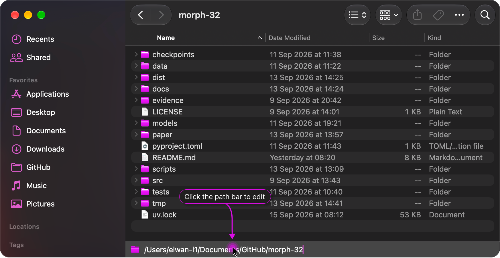

<p align="center">
  
</p>

<h1 align="center">Pathsta</h1>

<p align="center">A simple editable path bar for Finder.</p>

<p align="center">
  <a href="#install"></a>
  <a href="https://github.com/elwan-l1/pathsta/actions/workflows/ci.yml"></a>
  <a href="https://github.com/elwan-l1/pathsta/releases"></a>
  <a href="LICENSE"></a>
</p>

<p align="center">
  
</p>

> ⚠️ Pathsta has been entirely written by [Codex](https://openai.com/codex/) using GPT-5.6 Sol High. The project idea, guidance, and logo are mine.

Click Finder's path bar, type or paste a path and press Return. Pathsta follows the active Finder window, supports Tab completion and stays out of the way when you click elsewhere.

Pathsta requires macOS 27 or later. The reusable core remains tested on macOS 14, but the Finder integration and interface are supported only on macOS 27 and later.

## Features

- **Path completion:** Press Tab or Shift-Tab to cycle through matching folders, including symbolic links.
- **Safe folder creation:** Press Shift-Return to create one missing folder and navigate to it. Can be disabled from the menu bar.
- **Not found feedback:** Play a sound when a path cannot be found. Can be disabled from the menu bar.
- **Live synchronization:** The field follows the active Finder window and updates when its location changes.
- **Ready after login:** Pathsta launches automatically when you sign in. This can be disabled from the menu bar.
- **Manual updates:** Check for and securely install signed releases from the menu bar. Pathsta never checks or downloads updates in the background.

## Install

Download Pathsta from [Releases](https://github.com/elwan-l1/pathsta/releases).

Open Pathsta and allow Finder automation when macOS asks. Initial releases support Apple silicon.

### Security and privacy

Pathsta uses Hardened Runtime and requests only Finder Automation permission. It is deliberately not App Sandbox-enabled because its core purpose is navigating to arbitrary Finder paths. Directory reads and folder creation therefore run with the signed-in user's normal filesystem permissions. Folder creation is limited to one missing leaf beneath an existing directory and never creates intermediate folders.

## Build

Building the app requires macOS 27+, Xcode 27+ and Homebrew. Core package tests also run on macOS 14.

```sh
make bootstrap
make verify
make open
```

## Contributing

Issues and pull requests are welcome, especially compatibility fixes for other macOS versions. Please run `make verify` before submitting a change.

## License

Pathsta is available under the [MIT License](LICENSE).
